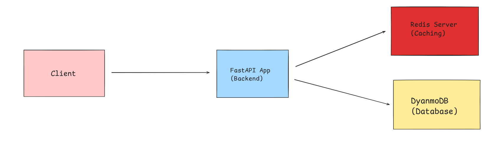

# Smol-URL: A Lightweight Highly scalable and Available  URL Shortener
A URL Shortener designed with FastAPI, Redis, and DynamoDB deployed using AWS ECS Fargate. Note that this project was built solely for my learning experience to get familiar with some AWS concepts.

## ✨ Features
- Shortens any URL using base62-encoded 7-char strings
- Redirects users efficiently via FastAPI
- Caches popular URLs in Redis (TTL = 1 hour)
- Stores permanent mappings in DynamoDB
- Rate limiting (10 requests/min per IP)
- Dockerized and deployed on AWS ECS Fargate

# 1. High Level Design


From the diagram above, we see that we have Four components:
* Client: A simple client app built using HTML (not implemented in this repo)
* Backend: A backend API Implementation using Python's FastAPI framework.
* Caching: A Redis server used to cache frequently hit short URLs with a TTL of one hour
* Database: A DynamoDB (NoSQL Database) hosted using the AWS DynamoDB service

The short URLs generated by the system will have seven characters of base62 meaning we would have 62^7 possible combinations ensuring we will most likely not run out of short URLs. However, one must note that when the database reaches contunies to increase in size, performance will likely downgrade because we will have frequent collisions. For example, with 1 million generated URLs, we will have ~13% chance of collisions. Read more about the [Birthday Problem](https://en.wikipedia.org/wiki/Birthday_problem). 

**Tech Stack:**
- Backend: FastAPI (Python)
- Cache: Redis
- Database: DynamoDB (AWS)
- Containerization: Docker + ECS Fargate
- Rate limiting: SlowAPI

# 2. 🛢 Database
The database design for this application is simple. The features of the database are: 
* Short_url (partition key) 
* Long_url
* num_clicks. 

AWS DynamoDB service is used for this application due to its ability to scale horizontally, ensure fast performance for the application based on the number of users.

If you want to use the application in your own, please create an AWS DynamoDB instance with features described above. You could use the following aws command:
```
aws dynamodb create-table \
    --table-name short-URLs \
    --attribute-definitions \ 
        AttributeName=short_url,AttributeType=S \
        AttributeName=long_url,AttributeType=S \
        AttributeName=num_clicks,AttributeType=N \
    --key-schema AttributeName=short_url,KeyType=HASH \
    --billing-mode PAY_PER_REQUEST \
    --region us-east-1

```
Note that you will need to set up an IAM user with DynamoDB user policies. Check out this  [tutorial](https://docs.aws.amazon.com/IAM/latest/UserGuide/id_users_create.html) for more info. 

# 3. 🖥 API
The API is built using FastAPI with two main endpoints:
*  `POST ./URL`: Allows the end user to create a short url for a given long URL. The payload is application/json with key being `url`. Example:
```
{
    "url": "https://www.example.com/very/long/url"
}
```
This endpoint returns a JSON object with `short_url` as key. 

* `GET ./{short_url}`: Redirects the user from the short URL to the long URL with status code of 303 if successful or 404 if not.

You could also check the `./docs` endpoint for more information.


# 4. 🗂️ Caching
The caching mechanism is implemented using Redis. We are using the Redis:8.3.2 image from dockerhub. You could find other images [here](https://hub.docker.com/_/redis). 

In this application, the caching system is implemented so that if someone requests a specific URL, it is put in the redis cache server with a TTL of one hour. This ensures high performance and availability by the system. 

# 5. ⚙️ How to Run Locally
You can run this application using docker 🐋
Please make sure you have docker installed in your system. Additionally, you need to have an AWS DynamoDB instance running in `us-east-1`. (refer to section 2).

Run these commands:
``` 
git clone https://github.com/Kareem404/smol-url.git
cd smol-url
``` 
Create a `.env` file containing you AWS IAM user `ACCESS_KEY` and `SECRET_ACCESS_KEY`.

Example `.env`:
```
ACCESS_KEY=your_access_key
SECRET_ACCESS_KEY=your_secret_access_key
````

Then, run:
``` 
docker compose up
```
This will run the application on `http://localhost:8001`.

# 6. How to Deploy
AWS ECS Fargate was used to deploy the application due its fast performance. Before deploying, make sure to change this line in `src/cache.py`: 
```
r = redis.Redis(host='172.17.0.1', port=6379, decode_responses=True)
```


to 
```
r = redis.Redis(host='127.0.0.1', port=6379, decode_responses=True)
```

Essentially, when using docker compose, inter-container communication happens using `docker0` namespace. Containers in the same task in ECS communicate in the same network; hence, we will will be using the IP `127.0.0.1`.

## 6.1 Push Image to ECR
You will need to push the docker image of the application to AWS ECR. To do so, first build the docker image:
```
docker build -t smol-url .
```
Second, create an ECR repository in AWS:
```
aws ecr create-repository --repository-name smol-url --region us-east-1
```
This command returns an object including information about the created repository.

Third, tag your created local image with the `repositoryUri`. You can find the repository URI in the returned object from the previous command.
```
docker tag smol-url [repositoryUri]
```
Fourth, push the image to the created ECR repository in AWS.
```
aws ecr get-login-password --region us-east-1 | docker login --username AWS \
--password-stdin [repositoryUri]
```
```
docker push [repositoryUri]
```

## 6.2 Deploy
First, you will need to create a cluster to host the containers:
```
aws ecs create-cluster --cluster-name myapp-cluster --region us-east-1
```
Second, modify the JSON object `task-def.json` to store the information about the images. Specifically, modify these parts of the object:
```
"environment": [
        { "name": "ACCESS_KEY", "value": "your_access_key" },
        { "name": "SECRET_ACCESS_KEY", "value": "your_secret_access_key" }
      ]
```
Also, modify this part to include the RepositoryURI:
```
"image": "[repositoryUri]",
``` 
Third, register this task:
```
aws ecs register-task-definition \
    --cli-input-json file://task-def.json \
    --region us-east-1

```
Fourth, from the AWS console, run the tasks and make sure you have a valid security group of your own to allow inbound access.

Alternatively, you can deploy this stack via the AWS Console or an Infrastructure-as-Code tool such as Terraform (future work).

## 🚧 Future Improvements
- Add authentication and user-based URL tracking
- Custom short URLs (user-specified)
- Analytics dashboard (total clicks, geographic stats)
- HTTPS enforcement and validation
- Terraform IaC deployment setup
